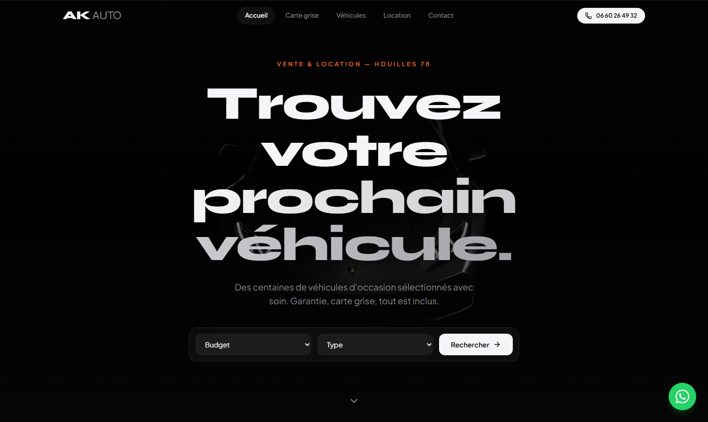

## Ren

19, France.

Full stack developer, data analyst, QA.

I work across the whole path rather than one slice of it: building the application, measuring what it actually does once it is live, and testing it properly before it ships. Most of what I do sits where those three meet, which usually means writing the measurement before trusting the number.

Currently doing live game analytics at Indigo.

### Working on

**An analytics platform for live games.** It pulls every metric Roblox's Creator Dashboard exposes for a title in one pass, then diffs each stored value cell by cell against ground-truth exports, so a number that cannot be trusted says so rather than being quietly wrong — partial days, synthesized zeros and revised readings are marked, not averaged in. It also tags releases and compares before against after, which is mostly the work of telling a real regression apart from weekday shape or a day that has not finished yet.

**[AK Auto](https://ak-auto-ten.vercel.app)** — site for a used car dealership near Paris, replacing a listings-only presence. Next.js, Tailwind, shadcn/ui, Supabase, deployed on Vercel, with an end-to-end Playwright suite.

<a href="https://ak-auto-ten.vercel.app">ak-auto-ten.vercel.app</a>

### How I work

AI is a standard part of it, Claude Code most of all. I use it daily to build, analyse and test, and a good deal of my work is figuring out how to point it at a problem so the output is actually verifiable.

**Languages** — TypeScript, JavaScript, Python, C, Lua, PHP, SQL, HTML/CSS

**Tools** — Next.js, React, Node, Playwright, Postgres, DuckDB, Supabase

