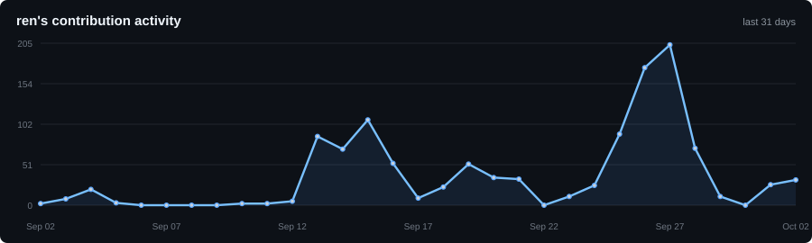
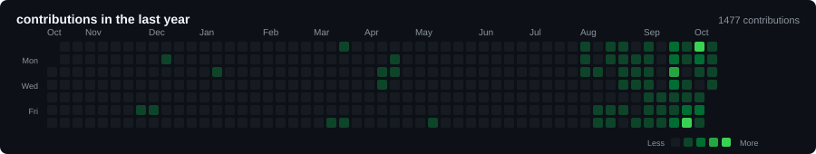

<h1 align="center">Dilan</h1>

  i "dev" using ai, just for ideas to come to life, and i also do research and data analysis

  only an undergrad student but i do alot of stuff on the side i wouldn't be able to do without ai, i don't just blindly do it though i try to understand the mechanism behind everything i do, helped me improve alot

  
  

---
### stack

### current

**live game analytics** : my only ever position, quality assurance for roblox games which expanded to data analysis etc, collecting roblox creator Dashboard metrics, validating stored values against ground-truth exports, flagging unreliable readings, and comparing releases against normal d2d variation.

**[testhunch](https://github.com/amazing-source/testhunch)** : learns from CI history which tests a change is most likely to break and runs those first. successful in some ways, unsuccessful in some ways too, it kept a very rigorous process tho

**research** : so that's what i'm focused on rn, i started research with my testhunch project, it really fascinated me so now i'm on conway's 99 graph problem, and so far so good, got some substantial results, im hoping to publish them soon

---
### activity

  

  

